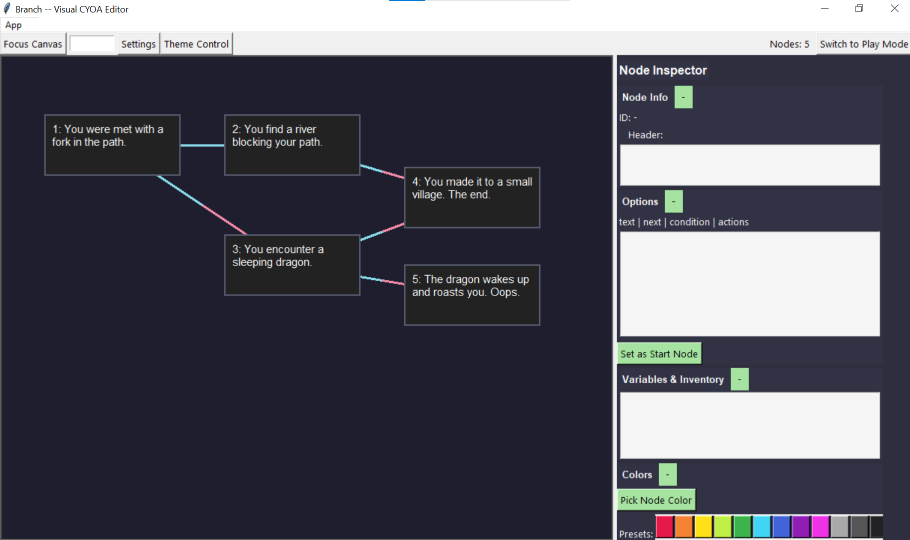

# 🌿 Branch — CYOA Maker

> Visual Editor + Runtime for building interactive choose-your-own-adventure (CYOA) stories.

[](https://www.python.org/)  
[](LICENSE)  
[](https://docs.python.org/3/library/tkinter.html)  

---

## ✨ What is Branch?

Branch is a **visual editor + runtime** that lets you build branching narratives — no heavy coding needed.  
Use **nodes, conditions, variables, inventory**, and instantly playtest inside the app.

<p align="center">
  
</p>

---

## ⚡ Features

- 🎨 Visual node editor  
- 🖌️ Customizable themes  
- 📜 Conditions & actions (e.g. `has_item:sword`, `var:gold > 5`)  
- 🎲 Randomized branching  
- 📦 Variables + inventory built in  
- ↩️ Undo / redo  
- 🔍 Search & zoom nodes  
- ▶️ Play mode & instant feedback  
- 💾 Save / load stories as JSON  

---

## 🛠️ Installation

```bash
git clone https://github.com/Ch3rryC0d3r/branch-cyoa-maker.git
cd branch-cyoa-maker
```

Make sure you have **Python 3.8+** and **Tkinter** installed. Then run:

```bash
python Branch.py
```

Or you can create a new "Text Document" and rename the file (if not already enable 'show extensions' in file explorer) to 'Branch.py' removing the extension and then you can paste the latest script inside, by opening a code editor or opening with any notepad such as (Windows') Notepad, any notepad works.

---

## 🚀 Usage

### Creating Nodes
- Right click background → **Add Node**  
- Edit node header & options in the inspector  

Options follow this format:  

```text
Text | NextNodeID | Condition | Actions
```
👉 You can learn more about Leaves (option lines) by checking [this guide](https://github.com/Ch3rryC0d3r/branch-cyoa-maker/blob/main/LeavesDocumentation.html)

---

### Conditions
```text
has_item:sword       # requires sword in inventory
var:gold==10 (or 'gold==10')        # requires gold == 10
```

### Actions
```text
set:gold=5 (or gold=5)     # set variable
add_item:sword             # add to inventory
remove_item:sword          # remove from inventory
rand_set:mood:happy,sad    # random choice
goto:5                     # force jump to node 5
```

---

### Play Mode
- Switch to **Play Mode** (toolbar button)  
- Choices are displayed as buttons  
- Restart or close play mode anytime  
(Located at the very top-right)
---

### Saving & Loading
- Save: `App → Save (Ctrl+S)` → saves to `./saves/your_story.json`  
- Load: `App → Load` → pick a JSON file  

---

## 📜 License
This project is licensed under the [MIT License](https://opensource.org/license/mit).

